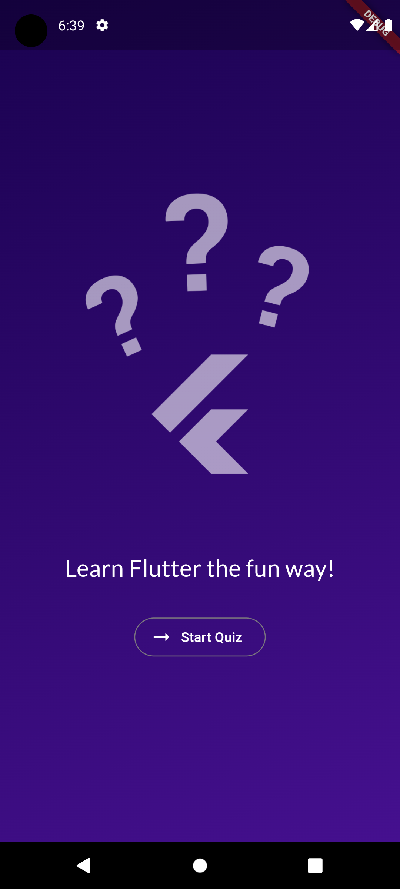
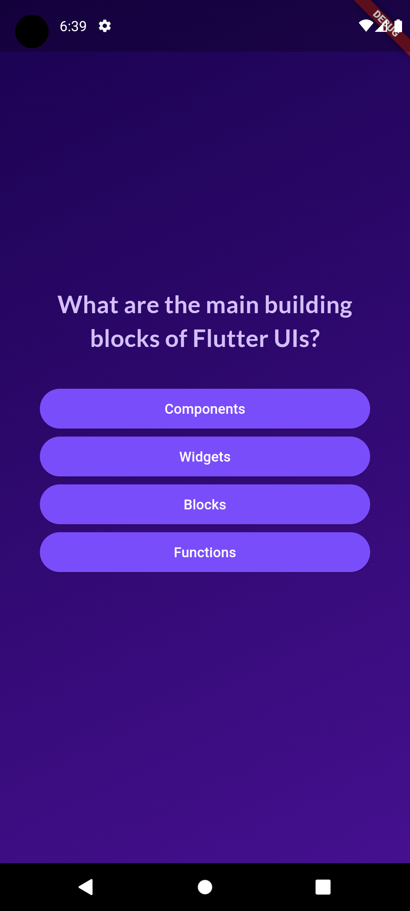
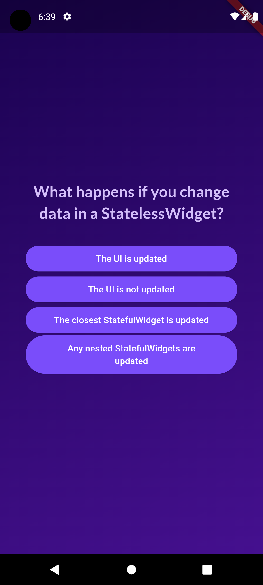

# quiz_app

A simple quiz application made with fluttter and it's most common packages.  
It utilises state management system built into flutter to collect data and build the ui accordingly. 

## Screenshots

